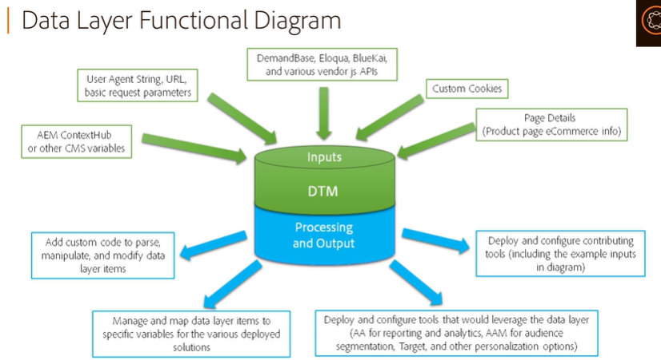
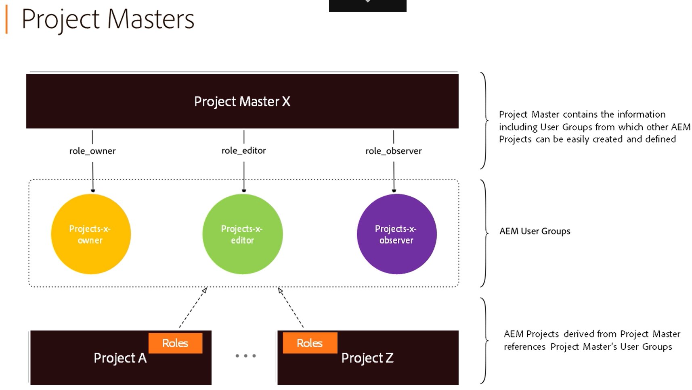

## AEM: Author Websites

https://solutionpartners.adobe.com/training/learning_program/learningProgram51067.html?PRIME_BASE=https://learningmanager.adobe.com&code=cffd0559bd7db81f0485bcf057c6aca0&state=state1

#### Use basic authoring capabilities

1. Which component provides support for responsive design out of the box in AEM? Select the correct answer
- Layout Components

2. Where is content duplicated when you promote launch content?

x Launch page

3. Which two configurations on your AEM Web Console Configuration Manager do you need to update with your machine's IPv4 Address? Select two.
- Day CQ Link Externalizer
- AEM Campaign Integration-Configuration

4. How does the DAM appear whitin the File Manager when you are using the AEM Desktop App? Select two.

x A local device | x An FTP server location

x A shared drive | x A network drive

5. Suppose a developer has concerns about the URL complexity on his website. Which AEM page property enables shorter, more expressive URLs?
- Vanity URL

6. How do you add a component from the Components tab to the Layout system?
- By dragging it

7. Where do you go to add metadata once an asset has been uploaded to the DAM from the web User Interface?
- View properties

#### Use Advanced Authoring Capabilities

1. What can you define in an editable template? Select two.

x The data model for the page | x The layout of the page for a variety of devices

x The ingration with other Marketing Cloud solutions | x The policies that define the design properties of a component

2. After you select the pages you want, which menu button allows you to activate those pages in bulk?
- Manage publication

3. Which of the following statements about an Experience Fragment is true?
- You can convert a layout container of an existing AEM web page to an Experience Fragment

4. Which of the following statements is true?
- You can use the assets from AEM Assets when building templates in the template editor

5. Which of the following actions would benefit the most from the inclusion of an Experience Fragment? Select two.
- Creating content that incorporates layout information
- Providing content for third-party touchpoints

6. What is the template author responsible for?
- Creating templates using the template editor

7. What can you use the template editor for? Select two.

x Creating static templates | x Positioning components on a responsive grid.

8. After you create a Content Fragment, what is the simplest method of reproducing it with slight modifications?
- Creating a variation

9. Which of the following can authors import into an existing Content Fragment? Select two.
- Text files
- PDF files

10. Which of the following statements about editable templates are true? Select two.
- They're created and edited by template authors or super users
- They allow you to define the structure and initial content

❗ Data Layer serve para juntar informações sobre quem entra no seu website. Esses dados podem ser enviados para o Adobe Analytics para ser analisado. Documentação do Data Layer para [saber mais aqui](https://github.com/adobe/adobe-client-data-layer).

❗ Context hub para manipular e utilizar dados e permite que as pessoas do marketing simulem o que os usuários verão. Contras: é um programa pesado e pode ser substituido pelo Adobe Layer, trackeando um usuário

#### Introduction to Project Capabilities

1. What can you do within the Inbox in AEM? Select three
- Manage tasks and projects
- Set item priorities
- Monitor workflows

2. Which of the following are available view types for items in your Calendar inbox? Select three

x List | Column | Thumbnail

3. Which statement is true for project master in AEM?
- Project masters create one set of shareable role-based user groups that derived projects can use

4. Which of the following options does the AEM Calendar offer? Select three
- Quick access button over each item
- Search and filter
- Colored status icons

5. What task is created in the Inbox and added to a project?

x Ad Hoc task

6. Which of the following statements about project masters are true? Select two

x They are actionable | x They have predefined properties

x They do not have a start or due date | x They are actionable

7. What are three task types you'll find in the Inbox? Select three
- Ad hoc
- Project
- Work Items

8. Complete the sentence below:
- The AEM Calendar allows you to schedule both projects and tasks

9. Which of the following determines the information and quick actions bar display in the Inbox?
- The type of item you select

10. Which of the following statements about the Inbox in AEM is true?
- The inbox allows you to reassign tasks to different users or user groups